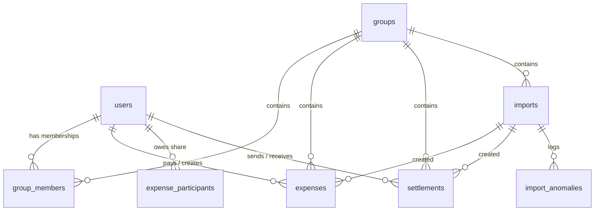

# 💸 Spreetail Shared Expenses App

A modern, high-fidelity React + Node.js/Express shared expense tracker (similar to Splitwise) designed to manage groups, track shared costs across mixed currencies (USD & INR), record direct settlement payments, and ingest messy spreadsheet data with an advanced, robust anomaly detection CSV engine.

---

## 🚀 Key Features

* **Login & Group Management**: JWT-token based secure registration and authentication. Create and manage groups where membership changes over time (members join and leave on specific dates).
* **Multi-Currency Engine**: Full native support for both **USD ($)** and **INR (₹)**. Group balances, net summaries, and recommended transfers are calculated and displayed separately per active currency.
* **Flexible Splits**: Handles all split methods required by messy CSV data:
  * `EQUAL`: Splits costs evenly, with rounding remainders absorbed by the last participant.
  * `EXACT`: Specifies precise amounts per person.
  * `PERCENTAGE`: Distributes costs based on custom percentages.
  * `CUSTOM`: Distributes costs based on relative weights/shares.
* **Robust CSV Audit & Import Engine**: Ingests messy exports exactly as provided, detects and logs 18+ types of validation anomalies (e.g. duplicate lines, timeline mismatches, disguised settlements, negative refunds, zero amounts, currency defaults, percentage scaling, and fractional values), and surfaces a detailed import report.
* **Cascading Import Rollbacks**: Deleting an import permanently rolls back the database, deleting the import log along with all associated expenses and settlements.

---

## 🛠️ Technology Stack

* **Frontend**: React (Vite, React Router v7, Axios, Vanilla CSS with custom Tailwind CSS v3 integration).
* **Backend**: Node.js, Express (ES Modules, Zod schema validation, Helmet & CORS middleware).
* **Database**: PostgreSQL (hosted on Neon), Prisma ORM.
* **Testing**: Vitest & Supertest (58 passing integration and unit tests).

---

## 💻 Local Setup Guide

Follow these steps to get the project running locally in under 5 minutes.

### 1. Prerequisites
Ensure you have **Node.js 20+** installed on your system.

### 2. Configure Environment Variables
Copy `.env.example` to `.env` in both directories:
* **Backend**: Configure [backend/.env](file:///d:/SplitWisetask/backend/.env) (pre-configured to connect to the live PostgreSQL database).
* **Frontend**: Configure [frontend/.env](file:///d:/SplitWisetask/frontend/.env) (`VITE_API_URL=http://localhost:4000/api`).

### 3. Run the Backend Dev Server
In your terminal:
```bash
cd backend
npm install
npm run dev
```
The API will start listening on `http://localhost:4000`.

### 4. Run the Frontend Dev Server
In a second terminal:
```bash
cd frontend
npm install
npm run dev
```
The frontend application will start and be available at `http://localhost:5173`.

### 5. Running the Test Suite
To run all 58 backend tests:
```bash
cd backend
npm test
```

---

## 🗄️ Database Design & Models

The PostgreSQL relational database contains 8 tables structured to keep tracking history precise, even as membership timelines shift:



* **`users`**: User credentials, emails, and bcrypt password hashes.
* **`groups`**: Metadata for expense groups.
* **`group_members`**: Implements join and leave intervals (`joined_at`, `left_at`). This ensures members who leave are not charged for expenses logged after their departure.
* **`expenses`**: Holds expense details (amount in `Decimal(19,4)` precision, currency, and split method).
* **`expense_participants`**: Represents the exact amount owed by each participant.
* **`settlements`**: Records direct debt repayments (never mixed with expenses).
* **`imports`**: Tracks CSV uploads and records SHA-256 hashes to block duplicate uploads.
* **`import_anomalies`**: Stores error/warning audit logs generated during parsing.

---

## 🤖 AI Tools Used

This project was developed in pair-programming collaboration with **Antigravity (Google DeepMind)**. 

* **Coding Assistance**: Designed modules, generated schema structures, and optimized Prisma queries.
* **Refactoring and Performance**: Wrote integration test suites and implemented bulk inserts to eliminate database write latency.
